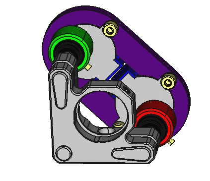

# Motorized Kinematic Mount (MKM)
Here we present a simple, flexible and cost-effective system that combines 3D printed components, an Arduino board, and simple electronics to automatize a vast majority of kinematic mounts available on the market.

  
  <figcaption><bolf>Figure 1. Fully assembled Motorized Kinematic Mount.</bold></figcaption>

The simplicity of the system relies on the components used to implement it. As can be seen on the gif figure, the system is composed of a 3D printed plate that supports two motors whose shafts are aligned with the knobs used to tip and tilt the plane of a kinematic mount that supports the optics. The cylindrical adapter used to couple the shaft to the knob is also 3D printed. To control the motors, an Arduino MEGA connected to a sensor shield is used. 

Regarding flexibility, the hardware and software of the system can be easily modified according to the user needs. From the hardware side, since the 3D printed components that couple the system to the kinematic mount were parametrically designed using [FreeCAD 0.16](https://www.freecadweb.org/), the system is highly tunable by changing a few parameters on a spreadsheet. Similarly from the software side, the Arduino code is well documented and some usage examples are provided in the *.ino file. 

Last but not least, the cost of the system is directly related to its simplicity. As a reference, the total cost of fabricating a system composed of four stepper motors that can be used to control two kinematic mounts is around 50 EUR. As a result the system developed compares favourably with respect to commercial alternatives that can be roughly between 5 to 10 times more expensive. However, a word of caution should be added here. Since the system keeps track of the number of steps given by the stepper motor of each channel to estimate its current position, some inaccuracies may appear due to the hysteresis present on the stepper motors. Therefore, the usefulness of the system presented here depends on the application. Fortunately, from our experience in the laboratory, we have found that the system is suitable for a wealth of applications ranging from teaching to research laboratories.

## List of materials
To motorize a kinematic mount, the following materials are required. It is assumed that the Arduino MEGA and the sensor shield have been already acquired.

| Component | Quantity |
|--------------|--------------|
| Parametric plaque (3D printed) | 1 |
| Knob adapter (3D printed) | 2 |
| M3 screw | 4 |
| Stepper Motor (28BYJ-48) | 2 |
| Dupont cable (patch of 6 cables) | 2 |

## Hardware Implementation
A single unit of the system, capable of controlling the tip and tilt of a kinematic mount, is composed of two stepper motors (28BYJ-48) attached to the 3D printed plaque that aligns the knobs of the kinematic mount with the axis of the motors. The axis are coupled to the knobs using a 3D printed knob adapter. The motor drivers are connected to an Arduino MEGA sensor shield (attached to and Arduino MEGA) using Dupont wire jumper cables. 

  
  <figcaption><bolf>Figure 2. Example of implementation for a Radiant Dyes kinematic mount.</bold></figcaption>

Regarding the stepper motor used, the 28BYJ-48 is a very cheap motor that requires five wires for its connection to the driver circuit (reference ULN2003). The motor can operate in the voltage range 5V to 12V and theoretically it gives 4096 steps per one turn. This number comes from the fact that the internal stepper motor that requires 64 steps to give a complete turn is connected to a set of gears that provide a reduction ratio of 1/64. As a result the 28BYJ-48 requires 64x64=4096 steps to complete a full turn. 

The following figure provides a connection diagram for two stepper motors. Each channel is composed of a stepper motor 28BYJ-48, driver electronics and a Dupont cable patch with six wires. Given the number of output pins available on the Arduino sensor shield, the board can be used to control up to five kinematic mounts simultaneously as shown in panel (b). In other terms, the shield can connect up to ten motors simultaneously (**Attention!** connecting more than four motors may require an external power supply).

  
  <figcaption><bold>Figure 3. Motorized Kinematic Mount connection diagram</bold></figcaption>

Since the 3D printed components that couple the stepper motors to the kinematic mount were designed using FreeCAD 0.16, the distance between motor axis on the plate (L), and the inner diameter (D) and height (H) on the knob adapters can be easily modified using a spreadsheet. To attach the motors to the PLA plate, four M4 screws are required, whereas two M3 grub screws are used to secure the knobs to the knob adapters.

  

The following table provides information on the parameters used for customizing the plate and the knob adapter to fit into four different types of kinematic mounts. 

Parameter | Thorlabs | Radiant Dyes | Liop-tec |
--- | --- | --- | --- | --- 
Axis distance | 10.0 | 10.0 | 10.0 | 10.0 
Diameter | 10.0 | 10.0 | 10.0 | 10.0 
Height | 10.0 | 10.0 | 10.0 | 10.0 

## Software Implementation
In order to provide flexibility and simplicity from the software perspective, each motor can be controlled independently by sending a simple instruction defined by a command table through the serial port. This approach enables the use of simple RS232 terminals such as Termite to control the system, or more elaborate code written in Python or Matlab (to name a few).

A command table is a dictionary of instructions that can be divided into two categories: commands and queries. The first category corresponds to a direct order such as "move stepper motor connected to port 3, half-turn". The second type of command is used to ask information to the device about its status; for example the state of a digital variable, the value of a given counter or the identification string that contains relevant information about the device and its manufacturer. 

| Command | Description |
|----------------|----------------|
| STPM:N:ABS:X | move STePper Motor N to ABSolute position X (in steps) |
| STPM:N:REL:X | move STePper Motor N, RELative to current position |
| STPM:N:RST   | ReSeT STePper Motor N counter to 0 |
| STPM:N:VEL:X | set STePper Motor N, VELocity to X, where X (1 fast / 10 slow) |
| STPM:N:ST?   | retrieve motor N current STatus (position, velocity, state) |
|              | velocity -> (1 fast / 10 slow) |
|              | state -> (0 stop / 1 moving) |
| STOP         | emergency stop. Press reset button to restart |

For reference, table \ref{tbl:command_table} shows the complete list of commands used to control and retrieve information of the status of each motor connected to the Arduino board. Since the status of each motor is determined by a variable that keeps track of the number of steps given by the motor, it is assumed a one-to-one correspondence between the number of steps defined by software and the number of steps given by the axis of the motor. A step on the clock-wise direction adds one unit to the counter; a step on the counter-clock-wise direction subtracts a unit. To keep the current status of each motor over time, each counter is stored in the non volatile section of the Arduino (EEPROM memory) so that all the information is available even though the Arduino board is powered off.

Since the control method is based on a command table, there are many alternatives to implement the software interface that controls the system. Depending on the application, the user may require to perform simple actions driven by simple commands, or a more elaborate sequence of tasks dependent on external signals or defined by an algorithm with temporal dependence. The former can be implemented by sending commands through the serial port using a serial communication terminal compatible with the RS232 standard such as Termite [reference] and the latter can be implemented using MATLAB or Python.
